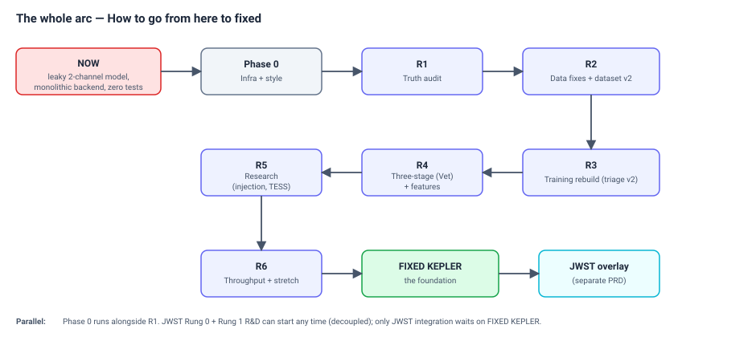

# SpaceSight — Roadmap (master execution sequence)

This is the **ordered task list** that takes SpaceSight from where it is now, to the
fixed Kepler system, to the JWST extension. It is the *what-to-do-in-what-order* doc
(no dates — order only). Each phase is a checklist; nothing that changes is meant to be
omitted. `[finalize]` marks a detail not yet decided — settle it before the task it
gates.

**This doc owns: the findings (what's wrong) and the phasing (the order to fix it).**
It does *not* re-explain the architectural decisions — those live in
[`adr/`](adr/) and [kepler-system-design.md](kepler-system-design.md); this doc
*references* them. The full target design is the design doc; the *why* behind each
decision is the ADRs; the detailed code/notebook findings are the appendix (§F/§P/§T
below).

Last updated 2026-07-13 (Phase 0 largely done — see checkboxes).

---

## 0. The whole arc at a glance

The arc, in order:
`NOW → Phase 0 → R1 → R2 → R3 → R4 → R5 → R6 → FIXED KEPLER → JWST overlay`.

Two things run **in parallel** with the transit phases, not after them:
- **Phase 0 infra** proceeds alongside R1 (it gates R1's reproducibility).
- **JWST Rung 0 + Rung 1 R&D** can start any time (decoupled from the transit fixes —
  see [JWST PRD §9](jwst-biosignature-prd.md)); only JWST *integration* waits on the
  fixed-Kepler milestone.

The current → target deltas each task closes are catalogued in the appendix (§F broken,
§P preprocessing-notebook, §T training-notebook). Architectural decisions are in the
ADRs ([0001–0011](adr/)).

---

## Phase 0 — Infra & style (parallel with R1; gates R1's reproducibility)

From [repo-restructure-and-mlops-plan.md](repo-restructure-and-mlops-plan.md) and
[style-guide.md](style-guide.md).

- [x] Rename `master` → `main`; force-push `origin/main` (coordinate with the team
      first); set default branch; delete `origin/master`.
- [x] Move `spacesight-frontend/.github/workflows/deploy.yml` to repo-root
      `.github/workflows/`; retarget trigger to `main`. (It never fires today — wrong
      directory.) **Add `working-directory: spacesight-frontend`** (or per-step `cd`):
      the workflow currently relies on its physical location for cwd, so `npm install`
      / `npm run build` will break from repo root without it.
- [x] Un-ignore `CLAUDE.md`; commit it.
- [x] Scaffold `ml/`: `notebooks/`, `src/spacesight_ml/`, `configs/`, gitignored
      `data/`.
- [ ] Confirm the Drive dataset is reachable; document how to download the needed
      subset (no DVC — see restructure plan).
- [x] Adopt tooling: `ruff.toml` (per style guide), `.prettierrc`
      (`{ "printWidth": 120 }`), Pyright (CI lenient), pre-commit hooks (Ruff +
      Prettier), CI gate (Ruff lint + Pyright + frontend lint/build).
- [x] One-time `style: apply formatters repo-wide` sweep; add `.git-blame-ignore-revs`.
- [ ] W&B in the (future) train loop; tmux habit for long runs.
- [x] Delete dead `spacesight-backend/app/main.py`. Retire
      `spacesight-frontend/API_REQUIREMENTS.md` — the authoritative API contract now
      lives in design doc §4–5 (which fully absorbed it); delete once the team has
      migrated any links.

Outcome: hazards removed, `ml/` scaffolded, style enforced, experiment tracking ready.

---

## R1 — Truth audit (the keystone; do before changing anything)

Find out how much of the reported performance is real before touching the model. Closes
nothing yet — it *measures*, producing the honest baseline every later phase is judged
against. See [ADR 0002](adr/0002-catalog-labels-never-features.md) (F1),
[ADR 0003](adr/0003-single-channel-triage.md).

- [ ] **F1 leakage probe.** On val, compare model output distributions for ch1-flat vs
      ch1-real windows *within the same label*. Train a trivial classifier on
      `std(ch1)` alone — meaningful AUC ⇒ the leak is real and quantified.
- [ ] **Single-channel ablation.** Retrain with `in_channels=1` (ch0 only), identical
      settings — the honest baseline the "+15 precision from ch1" claim must beat.
- [ ] **Star-level eval harness (T1).** Per star, aggregate window probs (max / top-k
      mean); report star recall + FP-rate vs threshold. The product decides at star
      level (`max > threshold`), so this — not the window sweep — sets the threshold.
- [ ] **Recall-vs-depth/SNR breakdown (T2).** Stratify test recall by `koi_depth`,
      `koi_model_snr`, period. Defines the detection floor for the README.
- [ ] `[finalize]` the threshold-selection metric (which star-level quantity, target
      recall) — feeds F3 in R3.

Outcome: honest numbers; know whether the second channel was real or leak.

---

## R2 — Data fixes & dataset v2 (regenerate once, correctly)

Fix construction, bake in train/serve parity (F2) and physical-units (instrument-
agnostic, [ADR 0007](adr/0007-core-vs-profile.md)) so the dataset is regenerated only
once. References §F (F4), §P (P1, P2).

- [ ] **F4 — retry failed downloads.** Exclude `status='failed'` rows when building
      `done_ids` (currently they're silently dropped forever).
- [ ] **P1 — drop ambiguous boundary windows** (midpoint within ±1 duration of the
      window edge but failing the strict test) instead of labelling them negative.
- [ ] **P2 — per-segment robust sigma-clip** (MAD, per segment) replacing the global
      std clip that inter-quarter offsets inflate.
- [ ] **P3 — WH baseline absorbs transits.** Mask known in-transit cadences before
      the WH fit (train side has ephemerides) so the baseline doesn't fit through dips
      and bias depths shallow; consider per-star λ by variability instead of one fixed
      `wh_lambda`. Must be in dataset v2 — re-fixing later means regenerating again.
- [ ] **P7 — `quarter` is a collection index, not the Kepler quarter number.** Use
      `lc.meta['QUARTER']` (current `enumerate(lc_collection)` indexing is harmless
      today but wrong, and bites once quarter-dependent logic is added).
- [ ] **F2 — train/serve preprocessing parity.** Extract detrend + window into one
      shared implementation in `ml/src/spacesight_ml/` that both training and backend
      import ([ADR 0011](adr/0011-notebook-package-backend-promotion.md)). Resolves the
      `wh_lambda` 1e9-vs-1e6 divergence by construction.
- [ ] **Physical-units windowing.** Window length in *hours*, resampled onto a fixed
      grid; the profile resolves hours → cadences. (Instrument-agnostic groundwork.)
- [ ] Regenerate → **dataset v2**.
- [ ] `[finalize]` the physical window length (hours) and resampling method.

Outcome: clean, leak-free, train/serve-matched, instrument-agnostic dataset v2.

---

## R3 — Training rebuild & triage model v2

Port notebook logic to the package (fixes F5, T6) and train the clean single-channel
**triage** model. References §T (T3, T4, T9, T10).

- [ ] **Port stable logic to `ml/src/spacesight_ml/`** (`data.py`, `model.py`,
      `train.py`, `evaluate.py`); notebooks become thin importers. Fixes F5
      (not-runnable-top-to-bottom) and T6 (doc-rot).
- [ ] **On-the-fly augmentation (P4, P5).** Move noise/phase-shift into
      `Dataset.__getitem__`; use crop-and-pad shift, not `np.roll` (which wraps the
      seam). Removes the baked-to-disk class-rebalancing side effect.
- [ ] **Cross-shard shuffle buffer (T3).** Interleave windows across several shards
      (current per-shard batches are correlated; a candidate cause of the epoch-76
      spike).
- [ ] **AMP / mixed precision (T9).**
- [ ] **LR-range test (T4).** The current `max_lr=5e-6` is far too low for AdamW.
- [ ] **W&B logging (T10).**
- [ ] **Train single-channel triage**; select threshold via the **star-level** eval
      (R1, F3); **write threshold + preprocessing_config + provenance into the
      checkpoint** ([ADR 0006](adr/0006-option-b-model-loading.md)). **Closes T11** —
      write the threshold into the checkpoint *actually being evaluated* (the current
      bug writes it into the wrong one, which would silently break the F3 fix).
- [ ] **Notebook-finding cleanups on port (T5, T7, T8):** delete the 1.702 "GELU
      gain" custom weight-init scaling unless an A/B shows benefit (T5,
      `model_def.py:142`); keep best-per-metric + last checkpoints only, not every
      per-epoch checkpoint (T7); use the unweighted criterion for *all* reported eval
      losses so they're comparable across sections (T8).
- [ ] **Backend reads operating params from the checkpoint** — the CNN threshold
      *and* `bls_threshold` (kills the hardcoded `cnn_threshold=0.70` at
      `main.py:130`/`processor.py:35`, the `bls_threshold` 7.0-default-vs-4.0-shipped
      divergence, and the divergent backend `CONFIG`). All operating thresholds are
      checkpoint-stored, never hardcoded server-side (F3).
- [ ] **Build batch-native stage interfaces** while rewriting stages
      (`triage(N)→N`) — free now, prerequisite for R6 parallelism
      ([ADR 0008](adr/0008-batch-cnn-fanout-bls.md)).
- [ ] `[finalize]` augmentation parameter ranges; the shuffle-buffer size.

Outcome: reproducible `python -m spacesight_ml.train`; **triage model v2** with a
star-level-selected, checkpoint-stored threshold. (= the "model v2 shipped" definition
below.)

---

## R4 — Three-stage architecture (Vet) + diagnostic features

Add the post-BLS Vet stage (the precision attack) and the Report-layer display
features. References [ADR 0001](adr/0001-three-stage-triage-search-vet.md),
[ADR 0002](adr/0002-catalog-labels-never-features.md),
[ADR 0009](adr/0009-vet-labels-never-drops.md); design doc §2.3–2.5.

- [ ] **Search emits a candidate list** per star (`period, t₀, duration, bls_power`),
      `t₀` absolute BJD — the Search→Vet contract (design doc §5.2).
- [ ] **`build_vetting_channels(segments, ephemeris)`** — the pure, catalog-free
      channel builder (the structural F1 fix). Shared by training and backend.
- [ ] **Vet CNN.** Architecture (extensible `in_channels`); channels in priority order
      (§4c appendix): global fold, local fold, secondary eclipse (rebuilt), odd/even,
      transit-subtracted residual.
- [ ] **Stage-C training protocol.** Build training features by running the *actual BLS
      code* on training light curves; catalog used **only to label** each candidate
      ([ADR 0002](adr/0002-catalog-labels-never-features.md)).
- [ ] **Backend pipeline becomes Triage → Search → Vet.** Vet runs per candidate; it
      **labels, never drops** ([ADR 0009](adr/0009-vet-labels-never-drops.md)); replaces
      the radius-heuristic `status`.
- [ ] **Triage gate as an isolated policy function** (`apply_triage_gate`), ON/hard for
      v1 ([ADR 0004](adr/0004-triage-gate-on-by-default.md)).
- [ ] **API stage-enum change** (three edits — there is no frontend `STAGE_MAP`):
      (1) backend `STAGE_MAP` (`main.py:98`) add `cnn_triage`/`cnn_vetting` + reindex;
      (2) frontend label array `STAGES` (`AnalyzePage.jsx:8`) rename
      `"CNN Inference"`→`"CNN Triage"`, insert `"CNN Vetting"`; (3) bump displayed
      stage count 7→8. `usePipeline.js` keys off numeric `stageIndex` — no change.
- [ ] **Visualization-honesty fixes:** remove the synthetic noise injection; show the
      *real* Search-derived periodogram (design doc §2.5).
- [ ] **Mandel-Agol model overlay** on the phase-folded chart (reuses `batman`).
- [ ] **Transit-shape (U vs V) display.** (Odd/even + secondary are Vet channels;
      centroid is out of scope — no TPF/pixel data.)
- [ ] `[finalize]` which channels make the v1 Vet model (the R4 ablation decides);
      the vetting threshold's selection metric; the confirmed/low-confidence cutoff.

Outcome: precision attack on the ~0.60 ceiling; channels constructible at serving time;
explainability displays. This is ROADMAP's "three-stage architecture".

---

## R5 — Research results

The publishable wins. Depends on the clean pipeline (R2–R4) and physical units (R2).
References [research-directions-discussion.md](research-directions-discussion.md).

- [ ] **Transit injection with `batman`.** Inject known-parameter transits into real
      quiet/FP light curves → unlimited labelled positives + **injection–recovery
      curves** (feeds the T2 recall-vs-depth analysis). Leakage guard: injected + real
      windows from the same star stay on the same split side.
- [ ] **Kepler→TESS transfer evaluation** (the headline). Train on Kepler, evaluate
      zero-shot + fine-tuned against the TESS TOI catalog. Scope the claim to
      short-period planets (TESS 27-day sectors).
- [ ] **Domain-randomization augmentation** (vary cadence/noise/gaps so the model can't
      overfit Kepler's observing pattern).
- [ ] `[finalize]` the TESS profile (a new instrument profile per
      [ADR 0007](adr/0007-core-vs-profile.md)); the transfer-eval target list.

Outcome: injection–recovery characterization; the cross-instrument generalization
result.

---

## R6 — Throughput & stretch

Optimizations and contained experiments. Throughput is **demand-driven** — do it when
wall time actually hurts, not before; correctness (R1–R4) comes first.

- [ ] **Parallel/GPU execution** ([parallel-processing.md](parallel-processing.md),
      [ADR 0008](adr/0008-batch-cnn-fanout-bls.md)). The batch-native interfaces were
      built in R3, so this is a strategy swap, not a rewrite:
  - [ ] CPU process-pool fan-out for BLS (the bottleneck), one star per worker.
  - [ ] GPU batched inference for Triage + Vet (wide batch); BLS stays on CPU.
  - [ ] Per-star timeout for the single-degenerate-star case.
  - Trigger: 5+ star uploads becoming annoying (CPU) / 20+ stars regularly or a GPU
        deployment (GPU). Not a prerequisite for anything.
- [ ] **TorchScript export** ([ADR 0006](adr/0006-option-b-model-loading.md)) once the
      architecture stabilizes — desync-proofs serving.
- [ ] **ACF/LS variability channel** in triage (the one ephemeris-free second channel —
      [ADR 0003](adr/0003-single-channel-triage.md)).
- [ ] **Transformer-encoder vs SE-block ablation** (post-dataset-v2 only).
- [ ] **Calibration (temperature scaling)** so thresholds transfer across retrains.
- [ ] **Telescope-profile abstraction** fully generalized (PLATO-ready).

Outcome: faster, desync-proofed, and the contained research experiments.

---

## Fixed-Kepler milestone

**Definition of "model v2 shipped"** (the gate between transit work and JWST
integration): single-channel triage model trained on dataset v2, star-level evaluated,
threshold stored in the checkpoint, backend loading it (TorchScript once R6 lands),
metrics reported in the README with the depth-stratified recall table. R4 adds the Vet
stage on top; R5 adds the research results. After this, the transit engine produces
reliable ephemerides — the prerequisite for JWST integration.

---

## JWST overlay (phase sketch — full plan in the PRD)

The JWST/biosignature extension has its own document
([jwst-biosignature-prd.md](jwst-biosignature-prd.md)) — the tasks there are not yet
fully designed, so this is a phase *overlay*, not a task list. It threads against the
transit phases as three independent tracks:

- **JW-A — Rung 0 scorer** (can start any time, decoupled). The disequilibrium +
  temperature-filter scorer over gallery/hand-entered abundances; the control-validation
  demo. `[finalize]` the abundance-vector contract first (PRD §6) — the molecule list,
  units, pair table, temperature thresholds.
- **JW-B — Rung 1 R&D** (parallel, the whole time). Synthetic spectra
  (petitRADTRANS/HITRAN) → molecule CNN; the ephemeris-driven spectrum extraction. A
  motivated owner learns radiative transfer (the only real risk). Trains on synthetic,
  validates on real JWST.
- **JW-C — Integration** (waits on the fixed-Kepler milestone). Point the abundance
  contract at the molecule CNN; wire the transit ephemeris into spectrum extraction; the
  unified detect→characterize→score demo for planets with both data products
  (K2-18b, WASP-39b, …).

Detailed JW-A/B/C task breakdown: to be written into the PRD as the planning firms up.

---

# Appendix — findings catalogue (the "what's wrong")

These are the detailed findings from the June 2026 review. The phases above reference
them by tag. Architectural findings (F1–F3) also have ADRs; the notebook-level findings
(F4, F5, P*, T*) live *only* here — they're training-side and out of scope for the
design doc.

## F — Critical findings

- **F1 — secondary channel: label leakage in training, dead weight in serving.** ch1 is
  built from catalog ephemerides; flat fill for false positives ⇒ "ch1 flat" correlates
  with the label (a shortcut that inflates val/test). At serving, uploads have no
  catalog ⇒ ch1 always flat ⇒ real planet hosts pushed toward "not a planet". Fix:
  single-channel triage + catalog-never-features.
  → [ADR 0002](adr/0002-catalog-labels-never-features.md),
  [ADR 0003](adr/0003-single-channel-triage.md). Closed by R1 (probe) + R3 (retrain).
- **F2 — train/serve preprocessing mismatch.** Backend asymmetric-WH `wh_lambda=1e9`;
  training symmetric-WH `1e6`. Fix: one shared implementation, params from the
  checkpoint. → [ADR 0006](adr/0006-option-b-model-loading.md),
  [ADR 0011](adr/0011-notebook-package-backend-promotion.md). Closed by R2/R3.
- **F3 — threshold provenance inconsistent.** *CNN threshold:* sweep picked 0.74,
  hand-overridden to 0.69, backend ships 0.70 — three values, none matching. *BLS power
  threshold (same class of problem):* `processor.py:35` defaults `bls_threshold=7.0`,
  but `main.py:131` and `test_processor.py:61` override to `4.0` — the shipped value
  diverges from the default and from the processor's own docstring/log lines, and no
  doc tracked it. Fix: both thresholds are operating params written into the checkpoint
  (alongside `operating_threshold`), backend reads them, never hardcodes. Closed by
  R1/R3.
- **F4 — failed downloads never retried.** `done_ids` includes `status='failed'` rows,
  so failed stars are silently dropped on every rerun. Closed by R2.
- **F5 — notebooks not runnable top-to-bottom.** Cell-order dependencies, variables
  referenced before definition. The strongest argument for moving stable logic into
  `ml/src/`. Closed by R3 (port to package).

## Channel priority (for the Vet model — R4)

Priority order, all servable post-BLS (the F1 lesson — built from the ephemeris, fill
must be label-independent for both classes):

1. Global phase-folded view (biggest literature-backed gain; EB signatures).
2. Local phase-folded view (fold negatives on a random period — label-independent fill).
3. Secondary eclipse, rebuilt from the BLS ephemeris, identically for both classes.
4. Odd/even depth difference (zeros for *all* windows lacking neighbours, both classes).
5. Transit-subtracted residual (orthogonal signal, no extra metadata).
6. Out-of-transit ACF / LS variability (also usable pre-BLS, in triage — R6).
   - Centroid / difference-image channels: out of scope (need pixel/TPF data uploads
     don't carry).

## P — Preprocessing-notebook findings

| # | Issue | Fix | Phase |
|---|---|---|---|
| P1 | Boundary-window label noise (edge clips a partial transit, labelled 0) | Drop ambiguous windows | R2 |
| P2 | Global sigma-clip before segmentation (inter-quarter offsets inflate std) | Per-segment MAD clip | R2 |
| P3 | WH baseline absorbs transits (fits through dips, biases depths shallow) | Mask known in-transit cadences before fitting; per-star λ | R2/R3 |
| P4 | Augmentation baked to disk (inflates storage; freezes diversity; unintended rebalancing) | On-the-fly in `__getitem__` | R3 |
| P5 | `np.roll` phase shift wraps the seam | Crop-and-pad / offset start index | R3 |
| P6 | Secondary extraction always looks forward `t + P/2` | Handle in the F1 redesign | R4 |
| P7 | `quarter` array is a collection index, not the Kepler quarter | Use `lc.meta['QUARTER']` | R2/R3 |
| P8 | Dead/misleading code (`is_pos` unused; `koi_meta` unused; flush_batch naming) | Clean on port | R3 |
| P9 | Drive I/O pattern (thousands of per-star `.npz`) | Consider sharding raw/processed when migrating | R2 |

## T — Training-notebook findings

| # | Issue | Fix | Phase |
|---|---|---|---|
| T1 | No star-level evaluation (all metrics window-level; product decides star-level) | Star-level eval; sets the threshold | R1 |
| T2 | No recall-vs-depth/SNR breakdown | Stratify test recall | R1 / R5 |
| T3 | Batches never mix across shards (correlated gradients; epoch-76 spike) | Cross-shard shuffle buffer | R3 |
| T4 | `lr=5e-6` as OneCycle max_lr (absurdly low for AdamW) | LR-range test | R3 |
| T5 | Weight-init pseudo-rigor (1.702 "GELU gain") | Delete custom scaling unless an A/B shows benefit | R3 |
| T6 | Doc-rot between markdown and code (min_recall, pos_weight, etc.) | Fix on port | R3 |
| T7 | Per-epoch full checkpoints to Drive (wasteful) | Best-per-metric + last only | R3 |
| T8 | Eval-loss criterion inconsistency (weighted vs unweighted across sections) | Use unweighted for all reported eval losses | R3 |
| T9 | No AMP / mixed precision | Add autocast + GradScaler | R3 |
| T10 | No experiment tracking | W&B | Phase 0 / R3 |
| T11 | Checkpoint/threshold coupling bug (threshold written into wrong checkpoint) | Write threshold into the checkpoint actually evaluated | R3 |

## Research-direction verdicts (summary)

Full reasoning in [research-directions-discussion.md](research-directions-discussion.md):
LSTM — skip (morphology, not long-range sequence). TimeGEN/TimeGAN — skip (use `batman`
injection instead). Telescope generalization — pursue (Kepler→TESS, R5). LS-first
secondary channel — adopted in modified form (became the Stage-C BLS protocol; LS recast
as a variability descriptor). Experiment tracking — W&B.
