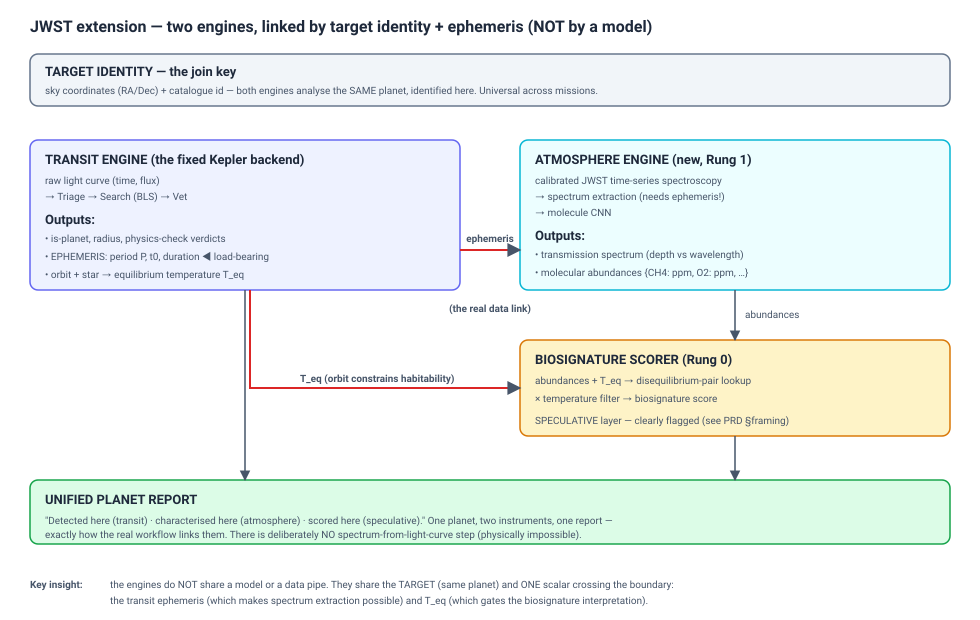
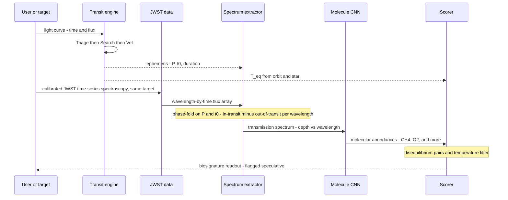
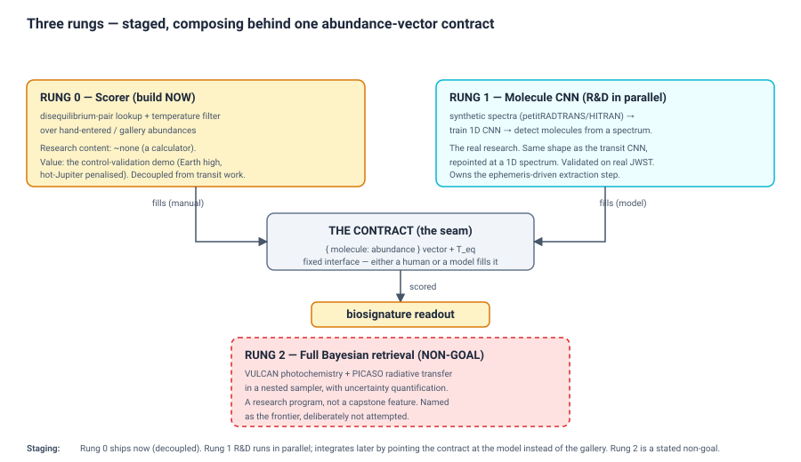

# SpaceSight — JWST Atmosphere & Biosignature Extension (PRD, early-stage)

> **Status: early-stage capture (2026-06-15).** This document records the design
> *discussion and decisions* for the JWST/biosignature direction — the months-out
> research extension — so the thinking isn't lost. It is intentionally **not** a
> finished, execution-ready plan: the goal is to envision the whole thing (with
> architecture, flow, and traces) while leaving detailed task planning for later.
> Sections marked `[finalize]` are open. This extension **derives from** the fixed
> Kepler backend ([kepler-system-design.md](kepler-system-design.md)); read that
> first.
>
> **Audience.** Internal. (A separate, polished framing will serve any external
> reviewers later.)

---

## 1. What this is, and what it is not

SpaceSight's transit pipeline *detects* planets. This extension adds the second half
of the real scientific workflow: *characterising* a detected planet's atmosphere from
JWST spectroscopy, and offering a **clearly-flagged-speculative** biosignature
assessment on top.

Inspired by the NASA Space Apps reference paper
([SpaceSight_Reference_Paper.md](SpaceSight_Reference_Paper.md)) — but where that paper
*scores* published abundances and punts on the hard part (extracting molecules from a
spectrum), this extension's research contribution is to **do the extraction** with the
same ML methodology the transit side already uses.

**Goals:**
- Characterise a planet's atmosphere (detect molecular species + rough abundances) from
  JWST transmission spectroscopy.
- Offer a biosignature score as a deliberately-bounded interpretive layer.
- Do it *generalizably* — the same way it links to any follow-up spectroscopic mission
  (JWST today, Ariel tomorrow), via the transit ephemeris + target identity.

**Non-goals (stated, so scope stays honest):**
- **Full Bayesian atmospheric retrieval** (Rung 2 — §4). A research program, not this.
- **Detector-level JWST calibration.** We start from MAST's *calibrated* time-series
  spectroscopy product, not raw frames (§5). Reimplementing STScI's calibration
  pipeline is out of scope.
- **A claim of detecting life.** The biosignature score is speculative and labelled as
  such (§7).

---

## 2. The core architecture — two engines, linked by identity + ephemeris

The single most important idea, and the one that's easy to get wrong:

> The transit engine and the atmosphere engine do **not** connect through a shared
> model or a data pipe. A Kepler light curve contains *zero* information about
> atmospheric chemistry — you cannot compute a spectrum from a light curve. The two
> engines connect the way real astronomy connects them: **same target (same planet),
> two instruments, two analyses, one report.**

Two things cross the boundary between the engines, and only two:

1. **The target identity** (sky coordinates RA/Dec + catalogue id) — the join key that
   says "both engines are analysing the same planet." This is mission-agnostic; it's
   how all of astronomy cross-references observations.
2. **The transit ephemeris** (period, t₀, duration) — *and this is load-bearing, not
   cosmetic*: it is what makes the JWST spectrum **extractable at all** (§3). Plus the
   equilibrium temperature `T_eq` (derived from the orbit + star), which gates the
   biosignature interpretation.

This is why the architecture is *better* as two engines than as one monolith: each is
independently testable and shippable, they develop on separate timelines, and each gets
its own injection-recovery validation story (`batman` for transits, synthetic spectra
for atmospheres).

**Honest constraint:** the *integrated* demo only works for planets with **both** a
Kepler/TESS light curve **and** a published JWST spectrum — a short list (K2-18b,
WASP-39b, a handful more). Those become the flagship end-to-end cases; everything else
runs one engine or the other.

---

## 3. The real link: ephemeris-driven spectrum extraction

This is the heart of the "generalizable, two-input pipeline" the project wants. The
transit engine's output (the ephemeris) is a **required input** to processing the JWST
data — you cannot turn raw JWST time-series spectroscopy into an atmosphere spectrum
without knowing *when the transit happens*, and that is exactly what the transit engine
produces.

**Reading the diagram, step by step.** The two engines never exchange model data —
they exchange a *target* and an *ephemeris*:

1. The user gives the **transit engine** the light curve for a target; it runs
   Triage → Search → Vet and detects the planet.
2. The transit engine emits two things the atmosphere side needs: the **ephemeris**
   (period, t₀, duration) to the spectrum extractor, and the **equilibrium
   temperature** `T_eq` (derived from the orbit + star) to the scorer.
3. Separately, the user supplies the **calibrated JWST time-series spectroscopy** for
   the *same target* — a wavelength-by-time flux array.
4. The **spectrum extractor** phase-folds that array on the transit engine's P and t₀,
   and differences in-transit against out-of-transit per wavelength → a transmission
   spectrum. *This step is impossible without the ephemeris* — which is why the two
   engines are genuinely linked, not just co-presented.
5. The **molecule CNN** reads the spectrum and emits molecular abundances.
6. The **scorer** combines those abundances with `T_eq` → a biosignature readout,
   flagged speculative (§7).

So only two things ever cross the engine boundary: the **target identity** (which lets
both engines fetch data for the same planet) and the **ephemeris + T_eq** (the single
scalar pair that makes extraction possible and gates the interpretation). There is
deliberately no "spectrum from light curve" step — that is physically impossible.

Read the `Note over X` step more closely: **the ephemeris from the transit engine
defines what "in-transit" vs "out-of-transit" means** in the JWST time series. Fold on
the transit-engine's P and t₀, difference the in/out spectra per wavelength → the
transmission spectrum. The same per-segment phase-folding math the BLS stage already
does, applied to a 2-D wavelength×time array instead of 1-D flux.

This is mission-agnostic by construction: *any* future spectroscopic follow-up mission
uses the same ephemeris + RA/Dec interface, because that is how astronomy works.

`[finalize]` the exact MAST product and its on-disk shape (§5); the fold/difference
algorithm details; how multi-visit JWST data is combined.

---

## 4. The three rungs — what we own, stage by stage

"Add atmosphere detection" is not one project; it's a choice of *which stage of the
spectrum→abundances→score pipeline you own*. Three rungs:

### Rung 0 — the scorer (build now)
The reference paper's scoring formula: disequilibrium-pair lookup table × temperature
filter, over **hand-entered or gallery** abundances. Research content ~zero (it's a
calculator), but high demo value — it reproduces the paper's striking
control-validation result (Earth-like scores high; hot Jupiter penalised ~95%). Fully
**decoupled** from the transit work (no spectrum, no ephemeris) — so it can ship
without waiting on the F1 fixes.

### Rung 1 — the molecule CNN (the real research, R&D in parallel)
Given a transmission spectrum, **detect which molecules are present** (multi-label) and
estimate rough abundances — *without* full physics-based retrieval. The method is the
transit side's method, repointed:

| | Transit side (exists) | Atmosphere side (Rung 1) |
|---|---|---|
| Input | 1-D light curve | 1-D spectrum (λ, depth) |
| Synthetic-data engine | `batman` transit injection | `petitRADTRANS`/HITRAN spectrum synthesis |
| Model | InceptionResNet1D | same architecture, repointed |
| Training story | inject known transits → recover | inject known molecules → recover |
| Validation | Kepler→TESS transfer | synthetic→real-JWST transfer |
| Hard part we don't do | — | full Bayesian retrieval (Rung 2) |

It trains on *synthetic* spectra (real JWST spectra exist for only a handful of planets
— enough to *validate*, nowhere near enough to *train*). This isn't a shortcut around
the data shortage; the synthetic-forward-model approach **is** the method. Rung 1 also
owns the §3 ephemeris-driven extraction step.

`[finalize]` choice of radiative-transfer tool (petitRADTRANS vs taurex); molecule list
+ abundance units (see contract, §6); CNN output head (multi-label classification vs
abundance regression vs both); the synthetic-spectrum parameter ranges.

### Rung 2 — full Bayesian retrieval (NON-GOAL)
VULCAN + PICASO in a nested sampler with uncertainty quantification. A research program
in its own right; even the reference paper lists it as unreached future work. Named here
as the frontier, deliberately not attempted.

---

## 5. Input boundary (a deliberate scoping decision)

We start from MAST's **calibrated time-series spectroscopy** product — *not* raw
detector frames. Everything downstream of that (the ephemeris-driven extraction, the
molecule CNN, the scorer) is ours and is mission-general. Detector-level calibration
(bias, flat-field, wavelength solution) is JWST-specific plumbing and a stated non-goal.
This is the exact analogue of the transit side sensibly starting from `time`/`flux`
rather than reducing raw Kepler pixels.

For the *first* Rung 1 demo, starting from an **already-extracted published spectrum**
(skipping even the extraction step) is a legitimate lower-risk staging point — prove the
molecule CNN works, then add the extraction that creates the real transit↔atmosphere
link.

`[finalize]` the precise MAST data product name/level and what it physically contains.

---

## 6. The abundance-vector contract (the seam that makes staging work)

Rung 0 and Rung 1 feed the **same scorer through the same interface**: a vector of
`{ molecule: abundance }` + a temperature. Rung 1 is not a rewrite of Rung 0 — it's a
new *producer* of the input Rung 0 was faking with manual entry. So when the molecule
CNN is ready, you swap the *source* of the abundance vector from "gallery/hand-entered"
to "model-inferred"; the scorer, the dashboard, and the biosignature logic are
untouched.

Build Rung 0 so the abundance vector arrives through **one function/endpoint**, and
Rung 1 integration is "make the model call that same function." Pinning this contract
early is what lets Rung 0 ship cleanly *and* gives the Rung 1 R&D a fixed target.

`[finalize]` the exact molecule list, the abundance **units** (ppm vs volume mixing
ratio — this bites if left ambiguous), the disequilibrium-pair table + weights, and the
temperature-filter thresholds. This is the highest-leverage thing to settle before any
Rung-0 code.

---

## 7. Biosignature framing — rigorous detection, bounded interpretation

How we hedge *is* the scientific contribution this subfield is missing, so it is
disciplined, not a throwaway disclaimer:

- **Molecule detection (Rung 1 output): presented as rigorous.** "We detect these
  molecules at these abundances, validated by injection-recovery and against published
  JWST spectra." Real science.
- **Biosignature score: a clearly-bounded interpretive layer**, with the *specific*
  reasons it's speculative named — not a generic "just for fun":
  1. it scores inferred abundances, not a full Bayesian retrieval with uncertainties;
  2. the disequilibrium-pair weights are heuristic, not first-principles photochemistry;
  3. abiotic false-positive pathways for these molecules are an open research problem
     (DMS, PH₃ especially are *actively contested* — K2-18b is a live controversy, not
     settled).

The landing framing: *discovery and characterisation are rigorous; the life
interpretation is a deliberately conservative, clearly-flagged heuristic — and that
honesty is itself the contribution.*

---

## 8. Worked traces

### Trace A — full integrated case (e.g. K2-18b)
A target with both a light curve and a published JWST spectrum. The transit engine
ingests the light curve → detects the planet, emits ephemeris (P, t₀, duration) and
`T_eq`. The spectrum extractor phase-folds the calibrated JWST time-series on that
ephemeris, differences in-transit vs out-of-transit per wavelength → a transmission
spectrum. The molecule CNN reads the spectrum → abundances (e.g. CH₄, CO₂…). The scorer
combines abundances + `T_eq` → a biosignature readout, flagged speculative. The unified
report shows: *detected here, characterised here, scored here* — one planet, both
instruments.

### Trace B — Rung 0 standalone (no transit data, no spectrum)
A user picks "Earth-like" from the gallery (or hand-enters abundances + temperature).
No transit engine, no extraction, no CNN — the scorer runs directly on the given
abundance vector. Earth-like → high score; a hot-Jupiter preset → penalised ~95% by the
temperature filter. This is the control-validation demo, shippable on day one,
completely decoupled from the transit fixes. (Deliberately has *no* transit link — that
arrives with Rung 1.)

### Trace C — Rung 1 on a spectrum, no ephemeris yet (early staging)
Before the extraction step exists, feed the molecule CNN an *already-extracted*
published spectrum directly. CNN → abundances → scorer. Proves the molecule detector
works in isolation; the ephemeris-driven extraction (the real transit↔atmosphere link)
is added afterward.

---

## 9. How this stages against the rest of the work

- **Rung 0** ships in an early iteration, decoupled — does not wait on the F1 transit
  fixes.
- **Rung 1 R&D** runs in parallel the whole time (it trains on synthetic data; needs
  nothing from the transit side until integration).
- **Integration** (point the contract at the model; wire the transit ephemeris into
  extraction) needs the fixed transit engine producing reliable ephemerides — i.e. it
  waits on the fixed-Kepler milestone.

The full ordering lives in [ROADMAP.md](ROADMAP.md) as a phase overlay (the JWST tasks
aren't fully designed yet — this PRD is the input to that planning).

---

## 10. Open questions (the backlog)

A structured place for "cool stuff we find later" — each entry gets: idea / why it fits
/ what it depends on / rough feasibility, so a new idea has an obvious slot and a forcing
function to assess it (not a junk drawer).

| Idea | Why it fits | Depends on | Feasibility |
|---|---|---|---|
| `[finalize]` molecule list + units + pair table | The contract everything hangs on | — | must do first |
| petitRADTRANS vs taurex for synthesis | Rung 1's data engine | someone learns radiative transfer | medium; the only real risk in Rung 1 |
| Ariel / other-mission spectroscopy | Proves the ephemeris link is mission-general | Rung 1 working | future |
| (add ideas here as they arise) | | | |
