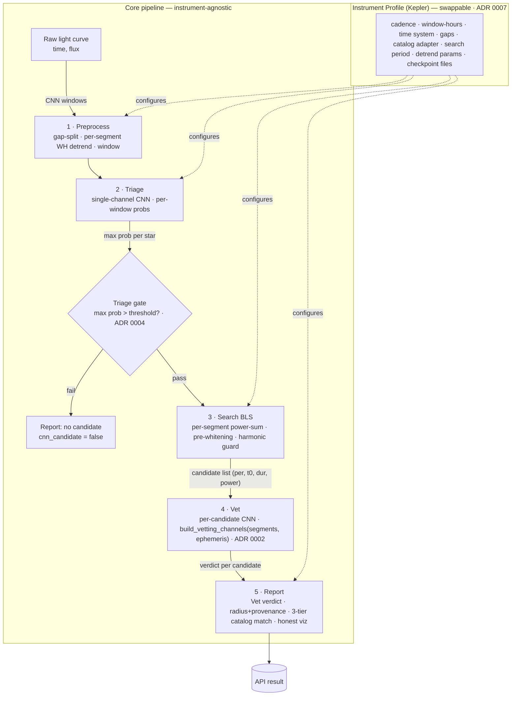

# SpaceSight — Kepler Backend System Design (canonical)

> **Preamble**
>
> **Purpose.** This is the canonical internal design for the *fixed* SpaceSight
> Kepler backend — the target state after the F1–F5 findings in
> [ROADMAP.md](ROADMAP.md) are resolved. It is the source of truth for *how the
> system is built*. The TESS competition entry and the JWST/biosignature
> extension are **derived** from this document (a profile swap and a new stage,
> respectively); they get their own PRDs.
>
> **Audience.** Internal — the team and future maintainers. Not the competition
> judges (the TESS PRD serves them) and not capstone evaluators directly.
>
> **Scope.** The **backend serving system**: the detection pipeline
> (Preprocess → Triage → Search → Vet → Report) and the FastAPI serving layer
> (job orchestration, the `/analyze` → `/status` → `/results` API, multi-star
> handling, the deferred parallel/GPU serving layer). The `ml/` training pipeline
> is referenced only via its **checkpoint contract** (§5.1). The React frontend is
> referenced only as an **API consumer**.
>
> **Success — two kinds, two owners.**
> - *Model-performance* success is defined by ROADMAP's "model v2 shipped"
>   definition ([ROADMAP §6](ROADMAP.md)); not restated here.
> - *Architectural* success is this document's own. The design is "done" when:
>   1. **Forking to a new instrument requires writing only a profile** — no core
>      changes. (§3)
>   2. **F1 cannot recur** — no model input is derived from the catalog. (§6)
>   3. **Serving preprocessing cannot drift from training** — both read one config
>      / import one implementation. (§5.1)
>
> **Related docs.** [ROADMAP.md](ROADMAP.md) (what to build, in what order) ·
> [research-directions-discussion.md](research-directions-discussion.md) (why the
> research bets were made) · [parallel-processing.md](parallel-processing.md)
> (deferred serving throughput) · [docs/adr/](adr/) (the "why" behind each
> decision here) · [CONTEXT.md](../CONTEXT.md) (glossary).

---

## 1. System overview

SpaceSight ingests raw Kepler light curves (`.npz` with `time` + `flux`) and
returns exoplanet candidates with explainable diagnostics. Detection is a
**three-stage architecture** ([ADR 0001](adr/0001-three-stage-triage-search-vet.md)) —
Triage → Search → Vet — bookended by Preprocess and Report:



A presentation-grade version of this diagram is committed at
[assets/kepler-pipeline.svg](assets/kepler-pipeline.svg).

Two framings run through everything below:

- **Core vs. Profile** ([ADR 0007](adr/0007-core-vs-profile.md)). The *core* is
  the instrument-agnostic pipeline + serving layer; it never names "Kepler",
  "201", or "BKJD". The *profile* is the thin instrument-specific layer it
  consumes. Forking to TESS = a new profile, not a rewrite.
- **The three decision stages** are Triage, Search, Vet. "Three-stage" is the
  canonical name — never "two-stage".

---

## 2. Core architecture (instrument-agnostic)

### 2.1 Preprocess

Splits the raw light curve on observation gaps (profile threshold, Kepler 24 h),
detrends each segment **independently**, and produces two outputs: strided CNN
windows (for Triage) and per-segment `(time, flux)` pairs (for Search).

Per-segment detrending is mandatory: Kepler's per-quarter aperture/sensitivity
changes create inter-quarter flux offsets of 1–5% that, if left in a single
stitched curve, raise the BLS noise floor to ~12,000 ppm and bury the 200–500 ppm
transits. Detrending is Whittaker-Henderson smoothing — plain symmetric WH for
flat segments, asymmetric (airPLS-style) reweighting for variable stars so the
baseline anchors to the out-of-transit continuum rather than chasing dips.

Window length is expressed in **hours** in the core; the profile resolves it to a
cadence count (Kepler: ~4 days ≈ 201 cadences). This is the physical-units rule
that makes the pipeline instrument-agnostic (ROADMAP R2/R5).

> **Gap (current → target):** today the backend and training detrend differently
> (backend asymmetric-WH `wh_lambda=1e9`; training symmetric-WH `1e6`) — finding
> **F2**. Target: one shared implementation in `ml/src/spacesight_ml/`, params
> read from the checkpoint (§5.1). Also tagged: per-segment robust (MAD)
> sigma-clip (P2), ambiguous-boundary-window dropping (P1).

### 2.2 Triage (Stage 1 CNN)

A single-channel ([ADR 0003](adr/0003-single-channel-triage.md)), ephemeris-free
CNN scores every window. The per-window probabilities are aggregated to a
**star-level** decision: `max(window probs) > triage_threshold`.

**The gate** ([ADR 0004](adr/0004-triage-gate-on-by-default.md)): a star failing
this test skips Search and Vet — the core cost-saving step (BLS is ~10× triage
cost). v1: gate ON, hard, but implemented as an *isolated policy function*
`apply_triage_gate(scored_stars, policy) -> survivors`, never an inline
early-return, so the future `soft-gate` / `off` modes are a pure addition. The
threshold is **star-level-selected** and read from the checkpoint (§5.1, F3).

Triage is single-channel **by physical necessity**: multi-view channels require a
phase-fold, which requires a period, which does not exist before Search (§6).

**Interface:** batch-native — `triage(windows: N×1×L) → N probs`, where N spans
all stars in a job ([ADR 0008](adr/0008-batch-cnn-fanout-bls.md)).

> **Gap:** today's model is 2-channel with the leaky ch1, threshold hardcoded
> `0.70`. Target: retrained single-channel triage, threshold in checkpoint
> (F1, F3, R3).

### 2.3 Search (Stage 2 — BLS)

Runs only on triage survivors. BLS runs **independently per detrended segment**;
the per-segment power spectra are summed at each trial period (the standard
multi-quarter approach — Kovács et al. 2002), avoiding the inter-quarter offset
problem. Iterative **pre-whitening**: after each detection its transits are masked
across all segments and BLS reruns (up to 10 iterations) to recover multi-planet
systems. A **harmonic guard** rejects a new period within ~5% of an accepted
period or its simple harmonics (2×, ½×, 3×, ⅓×), masking at the parent period's
ephemeris to avoid rediscovering the same signal.

**Emits, per star, a list of candidates**, each
`(period, t₀, duration, bls_power)` with `t₀` an **absolute** BJD (required so
pre-whitening masks land on the right cadences). A star may yield zero candidates
even after passing triage — reported honestly (§2.5).

**Execution:** BLS is the bottleneck and is irregular/iterative; it is
parallelized by **fanning out across CPU processes, one star per worker** — it
stays on CPU ([ADR 0008](adr/0008-batch-cnn-fanout-bls.md)). Deferred; v1 serial.

### 2.4 Vet (Stage 3 CNN)

Runs **per candidate** (not per star) — a star with N candidates gets N vetting
passes — because every vetting channel needs *that candidate's* ephemeris.

Channels are built by a pure function

```
build_vetting_channels(segments, ephemeris) -> tensor   # NO catalog argument
```

which is the structural F1 fix (§6, [ADR 0002](adr/0002-catalog-labels-never-features.md)).
The channel set is an **ordered, prioritized, extensible stack** (ROADMAP §4c) —
global phase-fold, local phase-fold, secondary eclipse, odd/even depth
difference, transit-subtracted residual — not a fixed count; `in_channels` is
config. The v1 vetting model ships the channels that earn their place in the R4
ablation.

Vet renders the per-candidate **verdict** and is the verdict owner
([ADR 0009](adr/0009-vet-labels-never-drops.md)): it **labels, never silently
drops**. A vetting threshold (checkpoint-stored) sorts candidates into "confirmed
candidate" vs "low-confidence/rejected", both inspectable.

**Interface:** batch-native — `vet(channels: M×C×L) → M scores`, where M spans all
candidates across all surviving stars.

> **Gap:** Vet does not exist yet — no architecture, no weights, no training data.
> It is built in R4, trained via the BLS-derived-ephemeris protocol
> ([research §4](research-directions-discussion.md)).

### 2.5 Report

Assembles the per-candidate output.

- **Verdict owner = Vet.** Radius-based heuristics (radius > 25 R⊕ → possible EB,
  < 0.4 R⊕ → noise) demote to secondary **sanity flags** alongside the Vet
  verdict, never a competing status.
- **Radius** = `R_star × √depth × 1.15` (limb-darkening). `R_star` comes from the
  profile's catalog adapter; it is a safe **output scaler**, not a model input
  ([ADR 0010](adr/0010-stellar-radius-is-an-output-scaler.md)). When absent it
  defaults to 1.0 R☉ and is flagged `stellar_radius_source: default_assumed` so
  an unreliable radius is never presented as authoritative.
- **Catalog match is three-tiered** through the profile's adapter: **Match**
  (within ~10% period → name + NASA period + accuracy), **Nearby** (outside match
  tol but within a sane bound, e.g. a harmonic → "nearest, for reference only"),
  **None**. No adapter / no match is a normal result, not an error.
- **Visualization honesty:** the displayed light curve is the *real* detrended
  flux (no fabricated noise), and the displayed periodogram is the **combined
  per-segment summed power spectrum from the first detection pass** — the one that
  actually selected the reported best period.
- **Diagnostic overlays (explainability displays).** Per confirmed candidate, the
  Report layer produces two display-only diagnostics — these are *presentation*
  features (post-detection visualizations), distinct from the Vet *channels* which
  are model inputs:
  - **Mandel-Agol model overlay.** Fit a Mandel-Agol limb-darkened transit model
    to the candidate's phase-folded light curve and overlay it on the chart. Reuses
    the `batman` package already adopted for injection testing (research-directions
    §2). Gives the user a "here's the physical model the data matches" view.
  - **Transit-shape (U vs V) display.** Show the folded transit shape with an
    ingress/egress assessment (U-shaped planetary vs V-shaped grazing-EB). This is
    the third of the reference paper's physics checks surfaced as a *display*;
    odd/even and secondary-eclipse are handled as Vet channels (§2.4), and the
    centroid check is out of scope (needs pixel/TPF data uploads don't carry).

> **Gap:** remove the synthetic Gaussian noise injection
> (`np.random.normal(0, 0.0005, …)`); replace the throwaway display periodogram
> (`linspace(0.5,50,500)` on raw flux) with the real Search-derived spectrum.
> Mandel-Agol overlay and transit-shape display are **new** (absent today) —
> build alongside the Report rebuild.

### 2.6 Model architecture (reference, not transcription)

The architecture's single source of truth is `ml/src/spacesight_ml/model.py`,
imported by both training and the backend ([ADR 0006](adr/0006-option-b-model-loading.md)).
This doc carries only the *shape*, never a layer-by-layer transcription (which
would re-create drift):

- **Family:** an InceptionTime-style 1D ResNet with Squeeze-and-Excitation
  attention. Chosen because transit detection in a short window is a *morphology*
  problem (find a U/V dip wherever it sits) — multi-scale convolutions + global
  average pooling encode exactly that ([research §1](research-directions-discussion.md)).
- **Shape contract:** input `(B, in_channels, L)` → single logit `(B,)`.
  Structure: stem → inception blocks (progressive widening) → SE → global average
  pool → classification head.
- **Two instantiations:** Triage (`in_channels = 1`), Vet (`in_channels = N`, the
  extensible channel stack).

---

## 3. The instrument profile

The profile is the only thing a fork rewrites ([ADR 0007](adr/0007-core-vs-profile.md)).

| Profile knob | Kepler value | Why instrument-specific |
|---|---|---|
| Cadence | 29.4 min (long) | TESS 2-min / 20-sec / 30-min |
| Window length | **hours** → ~4 d ≈ 201 cadences | resolved to cadence count per mission |
| Time system | BKJD (BJD − 2454833) | TESS uses BTJD (BJD − 2457000) |
| Gap threshold | 24 h | differs by downlink cadence |
| Catalog adapter | KOI (`koi_cumulative.csv`, `kepid`, `koi_period`…) | TESS = TOI (`tid`, different columns); uploads = none |
| Max search period | baseline-scoped | Kepler 4 yr vs TESS 27-day sector |
| Detrend params | `wh_lambda`, asymmetric iters | tunable per mission noise floor |
| Triage checkpoint | Kepler-trained `.pt` | each mission trains its own weights |
| Vet checkpoint | Kepler-trained `.pt` | " |

A fork supplies a new profile (a TESS profile swaps every row); the core and the
serving layer are untouched. Catalog adapter "none" (arbitrary upload) routes
straight to "no catalog match" — not an error.

---

## 4. Serving layer

### 4.1 Entrypoint & API

**One canonical entrypoint** (root `main.py`), async. This section is the
**authoritative API contract** (it supersedes the retired `API_REQUIREMENTS.md`).

**CORS / base URL.** Dev base URL `http://127.0.0.1:8000` (hardcoded in the frontend
`src/services/api.js`). Allowed origins: `http://localhost:5173`,
`http://localhost:3000`, `https://premity.github.io`.

**`POST /analyze`** — `multipart/form-data` with one field **`file`**: a `.npz` (one
star) or a `.zip` of up to 20 `.npz` files (multi-star). Each `.npz` must contain two
1-D arrays, **`time`** (BJD) and **`flux`** (matching length). Spawns a background
pipeline thread.

```json
// 200
{ "jobId": "uuid", "totalStars": 3 }
```
Errors (HTTP 400): non-`.npz`/`.zip` upload, empty zip, or zip exceeding 20 stars —
`{ "detail": "<message>" }`.

**`GET /status/{jobId}`**

```json
// 200
{ "stage": "bls_analysis", "stageIndex": 4, "progress": 60, "done": false,
  "error": null, "currentStar": 2, "currentStarName": "KIC 10593626",
  "totalStars": 3 }
```
Unknown job: `{ "error": "Invalid jobId", "code": 404 }` (returned as a 200 body with a
`code` field, not a real HTTP 404 — a current quirk worth preserving or fixing
explicitly).

**`GET /results/{jobId}`** — the full nested result once `done`; before completion
returns `{ "error": "Job not finished", "code": 400 }` (same body-not-status quirk).
See §5.3 for the full response schema.

**Stage enum (frontend loading screen):**
`loading → preprocessing → cnn_triage → bls_analysis → cnn_vetting →
generate_visualizations → done`.

> **Gap:** the current enum lacks `cnn_vetting` and names triage `cnn_inference`.
> Changing it touches three places (there is **no** frontend `STAGE_MAP` — the
> frontend keys off the numeric `stageIndex`, not stage-name strings):
> (1) backend `STAGE_MAP` (`main.py:98`) — add `cnn_triage`/`cnn_vetting` keys and
> reindex; (2) frontend label array `STAGES` (`AnalyzePage.jsx:8`) — rename
> `"CNN Inference"` → `"CNN Triage"`, insert `"CNN Vetting"`; (3) the displayed
> stage count (7 → 8). `usePipeline.js` needs no change. (The dead `app/main.py`
> and the stale `API_REQUIREMENTS.md` were deleted at the July 2026 restructure.)

### 4.2 Job state

`jobs` is an **in-memory, single-process ephemeral registry**
([ADR 0005](adr/0005-in-memory-job-registry.md)): per-upload UUID key holding
transient progress telemetry + the result payload. Load-bearing for the live
async request lifecycle, disposable across restarts. **Non-goals:** restart
survival, multi-worker, job history. **Escape hatch:** access via a small
interface (write-progress / write-result / read-status / read-result), so a future
shared store is a localized swap.

### 4.3 Orchestration ↔ science seam

The orchestration layer (jobs, progress, multi-star loop, cleanup, API) knows
nothing about Kepler; it calls a **profile-configured pipeline**.
`ExoplanetProcessor` is core science; the profile is injected. **TESS reuses the
orchestration layer verbatim** — this seam is what makes §3's "fork = new profile"
true at the serving layer too.

### 4.4 Execution strategy (deferred)

Batch the CNN wide (GPU when available), fan BLS out across CPU processes
([ADR 0008](adr/0008-batch-cnn-fanout-bls.md)). v1 ships **serial**; only the
batch-native stage interfaces (§2.2, §2.4) are built now so the deferred work
([parallel-processing.md](parallel-processing.md)) slots in as a strategy swap.

---

## 5. Contracts

### 5.1 Checkpoint contract (training ↔ serving boundary)

Each checkpoint (`triage_checkpoint`, `vetting_checkpoint`; same contract, named by
the profile) carries ([ADR 0006](adr/0006-option-b-model-loading.md)):

| Field | Purpose |
|---|---|
| `model_state_dict` | weights |
| `operating_threshold` | **star-level-selected**; backend reads it, never hardcodes (F3). The triage checkpoint also carries `bls_threshold` (the Search BLS-power cutoff — currently a divergent hardcode, 7.0 default vs 4.0 shipped); all operating thresholds are checkpoint-stored, none hardcoded server-side. |
| `preprocessing_config` | exact detrend/window params — **single source of truth**, so serving cannot drift from training (F2) |
| `provenance` | git commit, data version, train metrics, date (MODELS.md) |
| `architecture_config` | human/debug provenance only (not load-bearing under Option B) |

Architecture is loaded as a **shared class** imported from
`ml/src/spacesight_ml/model.py` (Option B). TorchScript export is deferred to a
roadmap item.

The backend and `ml/` import **one** implementation of the shared code
(preprocessing, model class, `build_vetting_channels`) from the curated
`spacesight_ml` package — never copies. The package is the membrane between the
experimentation playground (`ml/notebooks/`, messy) and the serving backend
(stable): notebooks promote stabilized code *into* the package (the milestone), and
both notebooks and backend import *from* it, so F2 train/serve drift is structurally
impossible. Full reasoning: [ADR 0011](adr/0011-notebook-package-backend-promotion.md).
The daily habit ("no duplication; import from `spacesight_ml`; promotion is a reviewed
PR") lives in the [style guide](style-guide.md).

### 5.2 Stage data contracts

- **Preprocess → Triage:** CNN windows `N×1×L` (+ per-segment pairs held for
  Search).
- **Triage → gate:** per-window probs → `max`-aggregated star-level score.
- **gate → Search:** the surviving stars' segment pairs.
- **Search → Vet:** per star, a list of candidates `(period, t₀, duration,
  bls_power)`, `t₀` absolute BJD.
- **Vet → Report:** per candidate, a vetting score/verdict.
- **Report → API:** the nested result (stars → planets → calculated / catalog /
  accuracy + light curve + periodogram).

### 5.3 API contract — `/results` response schema

Endpoints/requests/errors are in §4.1. The `/results` body is the full nested result:

```json
{
  "type": "multi",                 // "single" | "multi"
  "totalStars": 3,
  "totalPlanets": 4,
  "totalObservationSpan": 0.0,
  "totalDataPoints": 0,
  "stars": [
    {
      "id": "<job>-<index>",
      "name": "KIC 10593626",
      "planets": [
        {
          "id": "KIC 10593626 b",
          "orbitalPeriod": 7.05,       // days
          "transitDepth": 18.43,       // BLS power (named transitDepth in payload)
          "estimatedRadius": 1.32,     // R-earth
          "confidence": "High"         // "High" | "Low"
        }
      ],
      "noPlanetConfidence": 0,         // 0 if planets found, else a confidence
      "lightCurve": [ { "time": 131.51, "flux": 1.0002 } ],
      "blsPeriodogram": [ { "period": 7.05, "power": 18.4 } ],
      "observationSpan": 0.0,
      "dataPoints": 0,
      "error": null                    // present (string) only if this star failed
    }
  ]
}
```

A star that fails without sinking the job appears with a string `error` and empty
arrays. `type` is `"single"` for a one-star job, `"multi"` otherwise.

> **Target additions** (R4): per-planet objects gain the **Vet verdict/score** and
> the **sanity flags** (§2.5); radius gains `stellar_radius_source`
> (`catalog`/`default_assumed`); catalog match becomes the three-tier
> Match/Nearby/None (§2.5). The periodogram becomes the real Search-derived spectrum;
> the light curve drops the synthetic noise. `[finalize]` the exact field names for
> the verdict/flags when the Vet output is designed.

This section is the authoritative contract; `API_REQUIREMENTS.md` is retired.

---

## 6. The F1 resolution (the spine)

F1 — the ch1 label leak — is *why this redesign exists*. Full reasoning in
[ADR 0002](adr/0002-catalog-labels-never-features.md); the essence:

The current ch1 is built from catalog ephemerides — real flux for planet hosts,
flat fill for false positives — so "ch1 is flat" correlates with the label (a
shortcut that inflates metrics), and at serving time uploads have no catalog so
ch1 is *always* flat (a train/serve mismatch that pushes real planet hosts toward
"not a planet").

The fix is structural, in two parts:

1. **Triage is single-channel and ephemeris-free** — it never needed the catalog,
   so it cannot leak ([ADR 0003](adr/0003-single-channel-triage.md)).
2. **Vet's channels are built only from BLS output** — `build_vetting_channels(
   segments, ephemeris)` takes no catalog argument, and BLS produces the ephemeris
   at both training and serving time, so the function runs identically in both.
   The catalog appears at training **only to attach a label**, never to build a
   feature.

**The rule, enforced by a function signature, not by vigilance: the catalog may
label a training example; it must never feature-ize one.** This is architectural
success criterion #2 — F1 cannot recur without changing a signature the design
forbids.

Note the contrast with stellar radius
([ADR 0010](adr/0010-stellar-radius-is-an-output-scaler.md)): the F1 rule
constrains *model inputs*. Stellar radius is an *output scaler* from independent
upstream stellar data — safe, and outside this rule.

---

## 7. Worked execution traces

Concrete walkthroughs of data flowing through the architecture.

### Trace A — single clean planet host (serial happy path)

Upload `KIC_10593626.npz` (Kepler-90). Preprocess gap-splits into ~quarters,
detrends each, emits ~1,300 windows. Triage scores all windows; max prob 0.94 >
threshold → **passes the gate**. Search runs per-segment BLS, sums powers, finds
period ≈ 7.05 d, emits one candidate `(7.05, t₀, dur, power)`. Vet builds the fold
/ secondary / odd-even channels from that ephemeris, scores it "confirmed". Report
computes radius using the catalog `R_star`, matches the KOI entry (Match tier),
renders the real detrended curve + the Search periodogram. Loading screen walks
`loading → preprocessing → cnn_triage → bls_analysis → cnn_vetting →
generate_visualizations → done`.

### Trace B — large batch (~1000 light curves)

`/analyze` accepts the job (note: v1 caps zips at 20; 1000 illustrates the
*target* batched/parallel design). **Triage** batches all stars' windows into wide
inference (one GPU pass when available) → per-star `max` scores. **The gate** culls
to survivors — say ~80 of 1000 (most stars host no detectable transit, which is
exactly why the gate pays off). **Search** fans the 80 survivors across CPU
worker processes (one star per worker, adaptive on N); each emits its own
candidate list; the orchestration layer recombines them in original order as
workers complete. **Vet** batches *all candidates across all survivors* into one
wide pass → per-candidate scores routed back to their stars. **Report** assembles
the aggregate. Loading screen shows overall completion (`starsCompleted /
starsTotal`) rather than a single active stage, since many stars are in flight
(parallel-processing.md Option A).

### Trace C — the awkward cases

- **Triage-pass, Search-empty:** a star clears the gate but BLS finds nothing ≥
  threshold. Reported honestly as `cnn_candidate: true, planets_detected: 0` —
  information (triage flagged it; physics didn't confirm), not hidden.
- **Multi-planet + harmonic guard:** Search finds period P₁, masks it, reruns,
  finds P₂; on a later iteration finds 2×P₁ → the harmonic guard rejects it,
  masks at P₁'s parent ephemeris, continues. Two candidates emitted, each vetted
  independently.
- **No-catalog upload:** an arbitrary `.npz` with no catalog match. Triage/Search/
  Vet run normally; Report computes radius against the default 1.0 R☉
  (`stellar_radius_source: default_assumed`, flagged unreliable) and returns "no
  catalog match". No error.

---

## 8. Testing strategy

The repo currently has **zero tests**, and we are about to refactor an untested
*scientific* pipeline (F1 fix, retrain, three-stage) — the central risk this
strategy addresses. Correctness here is about *detection behavior*, not just code
paths.

- **Core-science unit tests** — deterministic pieces: windowing shapes/strides,
  gap-splitting, harmonic-guard ratio logic, radius math, the 3-tier catalog
  matcher, `apply_triage_gate` policy.
- **F1-guard test** — assert `build_vetting_channels` *structurally cannot* accept
  a catalog argument. This makes architectural success criterion #2 *enforced*,
  not aspirational.
- **Train/serve parity test (F2)** — serving preprocessing == training
  preprocessing (same shared function, same config from checkpoint).
- **Golden-master regression (the spine)** — pin `test_data/KIC_*.npz` (incl.
  Kepler-90) and assert the pipeline detects the **same planets at the same
  periods within tolerance** after any change. This is the "don't break on new
  features" net; it catches behavioral drift unit tests miss. Upgrades
  `test_processor.py` from an ad-hoc script into the seed of this suite.
- **Serving integration** — `/analyze → /status → /results` lifecycle, multi-star
  zip, gate culling, per-star error paths.

**When:** unit + F1-guard + parity on every commit (CI); golden-master before any
merge touching science; lint + build as the baseline green check
(restructure plan).

---

## 9. Explicit non-goals

- **Persistence / multi-worker / durable jobs** — in-memory single-worker is a
  deliberate scope boundary ([ADR 0005](adr/0005-in-memory-job-registry.md)).
- **TorchScript export now** — deferred until the architecture stabilizes
  ([ADR 0006](adr/0006-option-b-model-loading.md)).
- **GPU BLS** — astropy's C kernel stays; a port is a research project
  ([ADR 0008](adr/0008-batch-cnn-fanout-bls.md)).
- **Parallel/GPU execution** — deferred ([parallel-processing.md](parallel-processing.md));
  only batch-native interfaces built now.
- **Trim/essential-optional tagging** — the TESS doc's job, not this doc's; the
  30-hour limit is TESS's concern. This doc describes the *full* target system.
- **The TESS fork and the JWST/biosignature extension** — their own PRDs; this doc
  is only their shared foundation.

---

## 10. Current → target gap (summary)

References ROADMAP rather than restating it; each gap tagged with the item that
closes it. Ordering lives in [ROADMAP §6](ROADMAP.md); this is a
checklist-with-dependencies, not a re-sequencing.

**Broken — fix it:**

| Gap | Finding | Note |
|---|---|---|
| ch1 label leak (2-channel triage) | F1 | → single-channel triage ([ADR 0003](adr/0003-single-channel-triage.md)) |
| backend/training detrend mismatch (`wh_lambda` 1e9 vs 1e6) | F2 | → one shared impl, config from checkpoint |
| hardcoded `cnn_threshold=0.70` | F3 | → star-level threshold in checkpoint |
| dead `app/main.py` + stale `API_REQUIREMENTS.md` | — | ✅ deleted (2026-07 restructure) |
| synthetic noise injection in viz | — | remove (§2.5) |
| throwaway display periodogram | — | use real Search spectrum (§2.5) |
| global sigma-clip; ambiguous boundary windows | P2, P1 | per-segment MAD clip; drop ambiguous |

**Absent — build it:**

| Gap | Finding | Depends on |
|---|---|---|
| Single-channel triage retrain | R3 | dataset v2 (R2) |
| Vet CNN (architecture, weights, training) | R4 | Search ephemerides; BLS-derived training protocol |
| Core/Profile abstraction | R2/R6 | physical-units windowing |
| Checkpoint contract (threshold + preprocessing + provenance) | F2/F3 | shared `ml/` package |
| API stage-enum change (`cnn_vetting`) | — | backend `STAGE_MAP` + frontend `STAGES` label array + stage-count bump (§4.1) |
| Batch-native stage interfaces | — | (enables deferred parallel work) |
| Mandel-Agol model overlay (display) | — | `batman`; Report rebuild |
| Transit-shape (U vs V) display | — | Report rebuild |
| Test suite (golden-master spine) | — | pinned fixtures |
